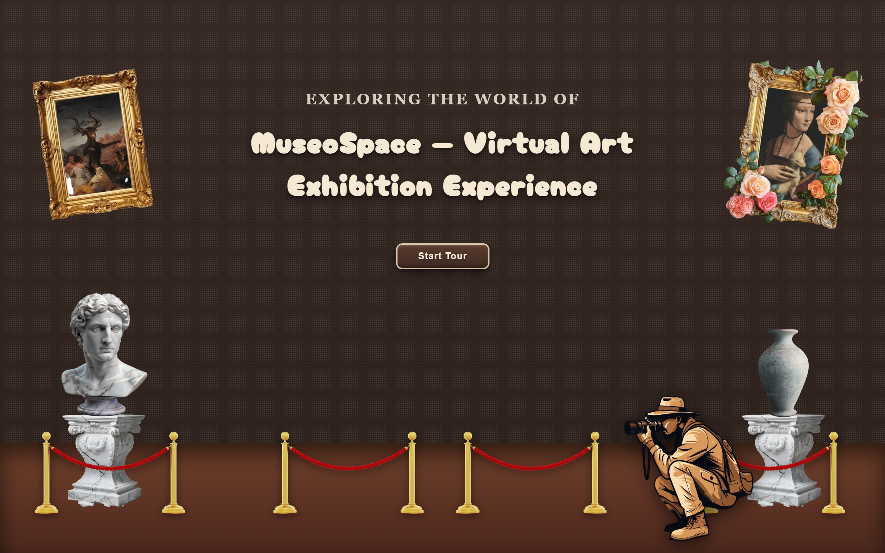
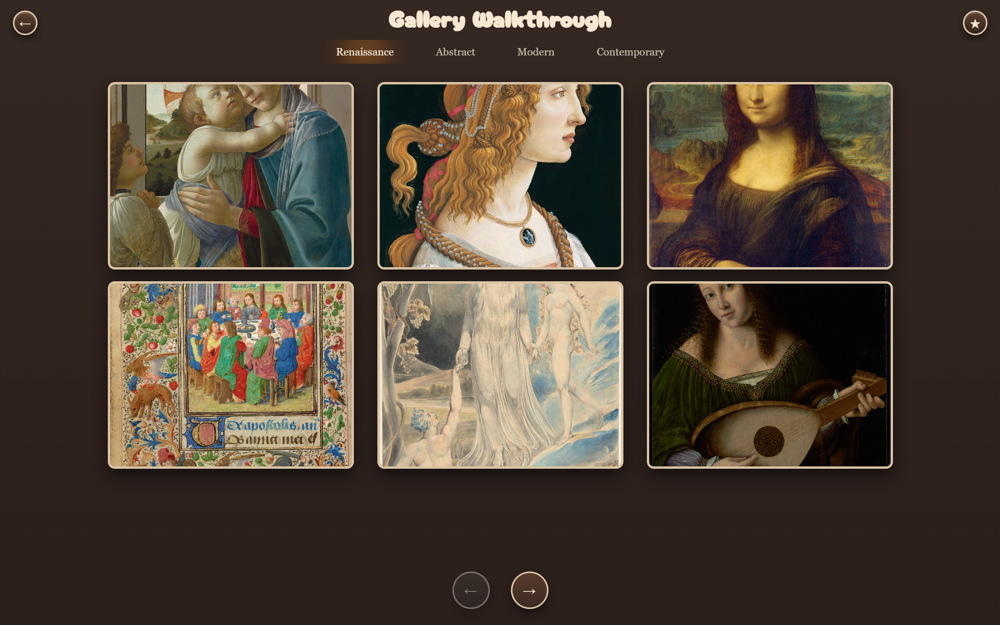
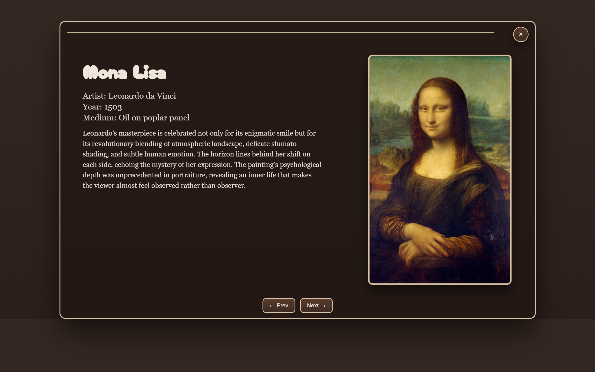
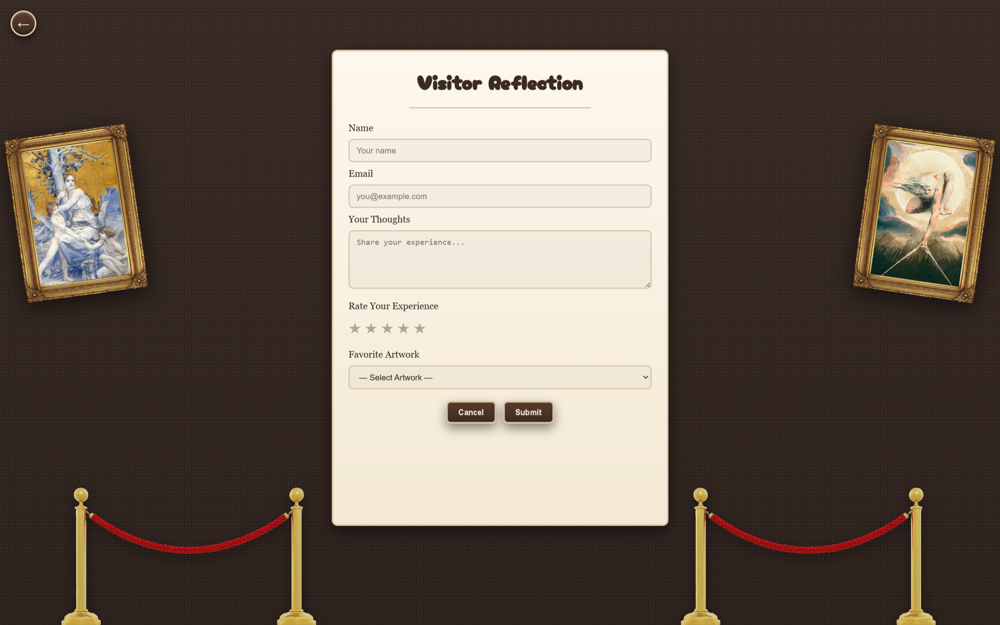

# 🏛 MuseoSpace – Virtual Art Exhibition Experience

<p align="left">
<b>An Interactive Virtual Museum Built with Pure HTML, CSS, and JavaScript</b>
</p>

<p align="center">


</p>

---

# 📌 Overview

**MuseoSpace** is an interactive **virtual art exhibition website** designed to simulate the experience of walking through a museum gallery.

The project focuses on **immersive UI design and smooth user interaction** using only **HTML, CSS, and vanilla JavaScript**, without any frameworks.

Users begin in a **museum lobby**, explore different **gallery sections**, view **artwork details**, and finally leave their **visitor reflection and feedback**.

The experience includes:

* Interactive museum lobby
* Multi-wall gallery navigation
* Artwork focus view with curator notes
* Visitor reflection & rating system
* Smooth animations and UI transitions
* Responsive layouts

The goal of the project was to demonstrate **creative front-end engineering and immersive UI design**.

---

# 🧠 Problem Statement

Traditional museum websites often present artworks as simple image lists without interactive storytelling or immersive exploration.

Common issues include:

* Static gallery pages
* Poor user engagement
* Limited storytelling around artworks
* Lack of user interaction

**MuseoSpace** solves this by creating a **virtual exhibition environment** where users can navigate between gallery sections and interact with artworks in a structured experience.

---

# 🚀 Features

### 🏛 Museum Lobby

* Animated museum environment
* Parallax effects on frames and objects
* Interactive **Start Tour** button

---

### 🖼 Gallery Walkthrough

* Multiple gallery walls
* Category-based navigation
* Artwork grid display
* Smooth transitions between walls
* Hover spotlight effect on artworks

Categories included:

```
Renaissance
Abstract
Modern
Contemporary
```

---

### 🎨 Artwork Focus View

* Detailed artwork display
* Artist information
* Year and medium
* Curator notes
* Next / Previous artwork navigation

Artwork data is dynamically loaded using **JavaScript objects**.

---

### ✍ Visitor Reflection System

* User feedback form
* Star rating system
* Favorite artwork selection
* Form validation
* Modal confirmation display

This simulates a **museum visitor feedback experience**.

---

### ✨ Visual Effects

The UI includes multiple interactive effects:

* Floating decorative frames
* Parallax motion effects
* Hover spotlight on artworks
* Animated dust particles
* Modal animations
* Smooth page transitions

These effects create a **cinematic museum atmosphere**.

---

# 🌐 Live Demo

🔗 **Visit MuseoSpace**

[https://keshav-26-2004.github.io/museospace/](https://keshav-26-2004.github.io/museospace/)

---

# 🖼 Application Screenshots

### 🏛 Home Lobby

<p align="center">

</p>

---

### 🖼 Gallery Walkthrough

<p align="center">

</p>

---

### 🎨 Artwork Focus Page

<p align="center">

</p>

---

### ✍ Visitor Feedback Page

<p align="center">

</p>

---

# 🏗 System Architecture

## Frontend

* HTML5
* CSS3
* JavaScript (Vanilla)

## UI Design

* Grid-based gallery layout
* Canvas-style artwork focus view
* Interactive navigation system
* Modal feedback interface

## Data Layer

Artwork information is stored in a **JavaScript data file**:

```
data.js
```

This includes:

```
id
title
artist
year
medium
shortNote
curatorNotes
image path
```

---

# 📂 Project Structure

```
museospace/
│
├── index.html          # Museum lobby
├── gallery.html        # Gallery walkthrough
├── artwork.html        # Artwork detail page
├── feedback.html       # Visitor feedback form
│
├── data.js             # Artwork dataset
├── style.css           # Global styles
│
├── assets/             # Images and visual assets
│
└── screenshots/        # README screenshots
```

---

# ⚙️ Tech Stack

| Layer       | Technology   |
| ----------- | ------------ |
| Structure   | HTML5        |
| Styling     | CSS3         |
| Interaction | JavaScript   |
| Deployment  | GitHub Pages |

---

# 🚀 Running Locally

Clone the repository:

```
git clone https://github.com/KESHAV-26-2004/museospace.git
```

Open the project folder and run:

```
index.html
```

in any modern web browser.

No installation or backend server required.

---

# 📈 Deployment

The website is deployed using **GitHub Pages**, enabling free hosting of static web applications.

---

# 🎨 Design Highlights

The project focuses heavily on **UI storytelling** and museum-like immersion.

Key design inspirations:

* classical museum environments
* vintage frame aesthetics
* warm lighting and gallery ambiance
* interactive artwork presentation

---

# 💼 Portfolio Summary

Developed **MuseoSpace**, an interactive virtual art exhibition website using **HTML, CSS, and JavaScript**, featuring gallery navigation, artwork detail views, animated UI effects, and a visitor feedback system.

---

# 👨‍💻 Author

**Keshav**
B.Tech CSE – Bennett University
Frontend & Full-Stack Developer

🔗 LinkedIn
[www.linkedin.com/in/keshav262004](http://www.linkedin.com/in/keshav262004)

---

# ⭐ Support

If you like this project, consider giving it a **star ⭐ on GitHub**.

---